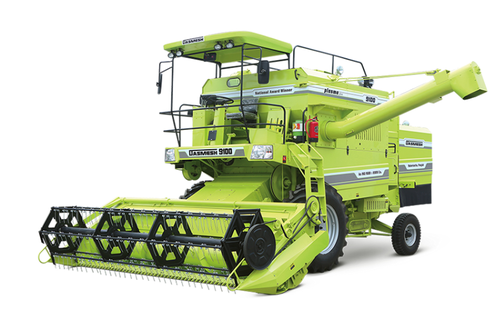
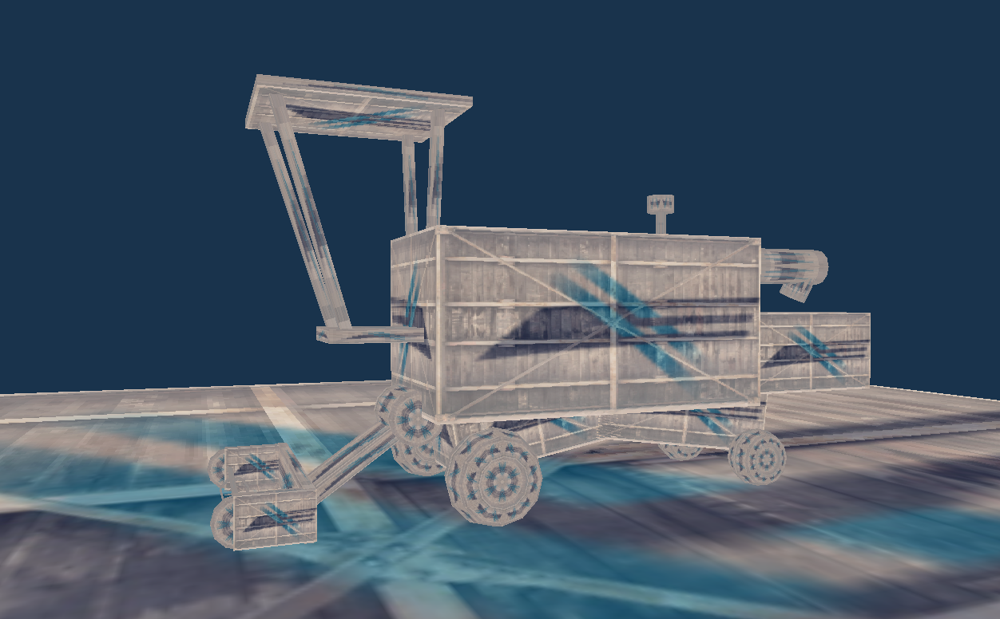

# Projekt GKOM 20Z
__Temat projektu:__ Kombajn (Harvester)

### Członkowie zespołu:
- Łukasz Pokorzyński
- Adam Steciuk
- Jakub Strawa
- Jarosław Zabuski

### Przykład kombajnu:

### Lista zadań (issues):
* Stworzenie sceny i skyboxa 
* Stworzenie modelu kombajnu
    * Koła
    * Nagarniacz, podajnik, zespół tnący
    * Kabina
    * Karoseria
    * Elementy dodatkowe
* Utworzenie elementów ruchomych
* Obsługa interakcji użytkownika
    * Ruch kamery i pozycji obserwatora
    * Interakcja z kombajnem
* Nałożenie tekstur 
* Oświetlenie

### Podział zadań: 
- Łukasz Pokorzyński: prymitywy graficzne, modelowanie kombajnu, kamera, pliki odpowiedzialne za ładowanie shaderów
- Adam Steciuk: prymitywy graficzne, zamodelowanie sceny i skyboxa, przygotowanie tekstur (obrazów), kamera
- Jakub Strawa: prymitywy graficzne, modelowanie kombajnu, elementy ruchome
- Jarosław Zabuski: nagarniacz, podajnik, zespół tnący; oświetlenie

### Punkty kontrolne (milestones):
* [X] Przygotowanie repozytorium (plik README)
* [ ] Podział ról i zadań, wstępne omówienie projektu
* [ ] Zamodelowanie otoczenia
    * [ ] Podłoże
    * [ ] Tło
* [ ] Zamodelowanie obiektów
    * [ ] Kombajn
    * [ ] Otoczenie
        * [ ] Obiekty środowiska
        * [ ] Ozdoby
* [ ] Zamodelowanie kamery i jej ruchu
* [ ] Zaprogramowanie ruchu obiektów
* [ ] Dodanie interakcji od użytkownika
    * [ ] Tryb kamery swobodnej i przypietej do kombajnu
    * [ ] Poruszanie kombajnem
* [ ] Teksturowanie obiektów
* [ ] Dodanie oświetlenia
* [ ] Dodanie cieniowania
* [ ] Oddanie gotowego projektu na spotkaniu nr 7

### Aktualny stan projektu (14.01.21r):
