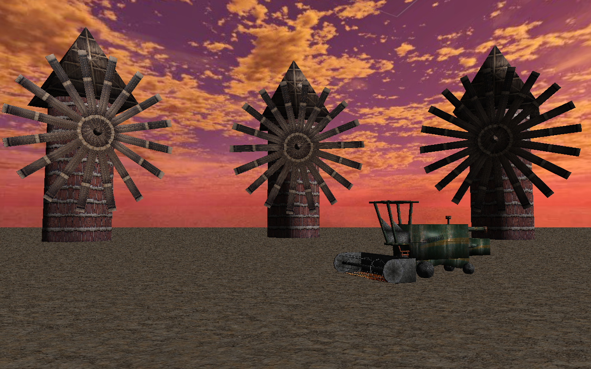

# Projekt GKOM 20Z
__Temat projektu:__ Kombajn (Harvester)

### Członkowie zespołu:
- Łukasz Pokorzyński
- Adam Steciuk
- Jakub Strawa
- Jarosław Zabuski

### Przykład kombajnu:

### Lista zadań (issues):
* Stworzenie sceny i skyboxa 
* Stworzenie modelu kombajnu
    * Koła
    * Nagarniacz, podajnik, zespół tnący
    * Kabina
    * Karoseria
    * Elementy dodatkowe
* Utworzenie elementów ruchomych
* Obsługa interakcji użytkownika
    * Ruch kamery i pozycji obserwatora
    * Interakcja z kombajnem
* Nałożenie tekstur 
* Oświetlenie

### Podział zadań: 
- Łukasz Pokorzyński: prymitywy graficzne, modelowanie kombajnu, kamera, pliki odpowiedzialne za ładowanie shaderów; oświetlenie
- Adam Steciuk: prymitywy graficzne, zamodelowanie sceny i skyboxa, przygotowanie tekstur (obrazów), kamera
- Jakub Strawa: prymitywy graficzne, modelowanie kombajnu, elementy ruchome
- Jarosław Zabuski: nagarniacz, podajnik, zespół tnący; oświetlenie

### Punkty kontrolne (milestones):
* [X] Przygotowanie repozytorium (plik README)
* [X] Podział ról i zadań, wstępne omówienie projektu
* [X] Zamodelowanie otoczenia
    * [X] Podłoże
    * [X] Tło
* [X] Zamodelowanie obiektów
    * [X] Kombajn
    * [X] Otoczenie
        * [X] Obiekty środowiska
        * [X] Ozdoby
* [X] Zamodelowanie kamery i jej ruchu
* [X] Zaprogramowanie ruchu obiektów
* [X] Dodanie interakcji od użytkownika
    * [X] Tryb kamery swobodnej i przypietej do kombajnu
    * [X] Poruszanie kombajnem
    * [X] Użytkownik określa długość oraz ilość niektórych elementów
* [X] Teksturowanie obiektów
* [X] Dodanie oświetlenia
* [ ] Dodanie cieniowania
* [x] Oddanie gotowego projektu na spotkaniu nr 7

### Aktualny stan projektu (26.01.21r):
